# Portfolio Template Architecture

## 📊 Visual Architecture Diagram

```mermaid
graph TD
    A["🌐 index.html<br/>Main Webpage"] --> B["📝 Content Sections"]
    A --> C["🎨 Styling Links"]
    A --> D["⚙️ Script Links"]
    
    B --> B1["🦸 Hero Section<br/>Your intro & profile"]
    B --> B2["ℹ️ About Section<br/>Who you are"]
    B --> B3["📊 Skills Section<br/>Your abilities"]
    B --> B4["💼 Resume Section<br/>Experience & Education"]
    B --> B5["🖼️ Portfolio Section<br/>Your projects"]
    B --> B6["🎯 Services Section<br/>What you offer"]
    B --> B7["⭐ Opportunities<br/>NEW: ETH Zurich"]
    B --> B8["📞 Contact Section<br/>Contact form"]
    
    C --> C1["🎨 main.css<br/>All styling<br/>- Colors<br/>- Layouts<br/>- Fonts<br/>- Animations"]
    
    D --> D1["⚙️ main.js<br/>Interactive features<br/>- Scroll animations<br/>- Menu toggles<br/>- Form handling"]
    
    C1 --> C2["🎭 Color Variables<br/>--accent-color<br/>--background-color<br/>--default-color"]
    C1 --> C3["📐 Section Styles<br/>.hero { }<br/>.about { }<br/>.portfolio { }"]
    
    E["📁 assets/img/<br/>Images folder"] --> E1["👤 person/<br/>People photos"]
    E --> E2["🖼️ portfolio/<br/>Project images"]
    E --> E3["🎯 profile/<br/>Your profiles pics"]
    
    style A fill:#22e7a1
    style B fill:#293443
    style C fill:#293443
    style D fill:#293443
    style C1 fill:#38485f
    style E fill:#38485f
```



---

## 🎯 What This Diagram Shows

### **Top Level: index.html**
Your main webpage file that connects three major areas:
- **Content Sections** (📝) - The HTML structure and all page sections
- **Styling** (🎨) - Links to CSS files that make everything look good
- **Scripts** (⚙️) - Links to JavaScript files for interactions

### **Content Sections Branch**
These are the 8 main sections of your portfolio:
1. **Hero** - Your introduction and profile picture
2. **About** - Information about who you are
3. **Skills** - Your professional abilities and expertise
4. **Resume** - Your work experience and education
5. **Portfolio** - Examples of your projects
6. **Services** - What you offer to clients
7. **Opportunities** - Current opportunities (NEW: ETH Zurich)
8. **Contact** - Contact form for visitors

### **Styling Branch**
CSS file that controls:
- **Color Variables** - Defined once, used everywhere
- **Section Styles** - Specific styling for each section type

### **Scripts Branch**
JavaScript that handles:
- Scroll animations (AOS - Animate On Scroll)
- Mobile menu toggles
- Form submission

### **Images Folder**
Organized by category:
- **person/** - Photos of people
- **portfolio/** - Your project images
- **profile/** - Your personal profile pictures

---

## 💡 How It All Works Together

```
User opens website
        ↓
index.html loads and includes:
    ├─ main.css (makes it look beautiful)
    ├─ main.js (makes it interactive)
    └─ All content sections (what they see)
        ↓
Sections display with styling applied + animations
        ↓
User scrolls → animations trigger → interacts with forms/links
```

---

## 🔄 Modification Flow

**When you want to change something:**

| What | Where | How |
|-----|-------|-----|
| Text content | index.html | Edit directly |
| How it looks | main.css | Modify styles |
| When/how things move | main.js | Adjust animations |
| What image shows | assets/img/ | Replace files |

---

## 📚 Related Documentation

- **TEMPLATE_GUIDE.md** - Complete customization guide
- **PORTFOLIO_ARCHITECTURE.mmd** - Pure diagram file for viewing

